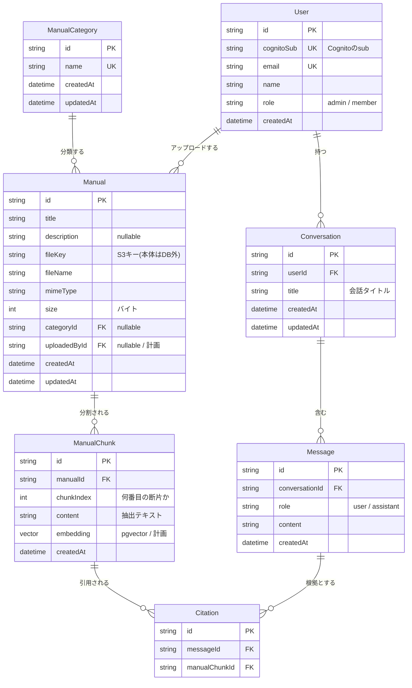

# ER図：社内マニュアル検索システム

現在のスキーマ（実装済み）と、今後追加予定のエンティティを含めた全体のデータモデル。

- ✅ 実装済み: `ManualCategory`, `Manual`
- 🔲 計画中: `ManualChunk`（RAG時）, `User`（認証時）, `Conversation` / `Message`（チャット時）, `Citation`（RAG時）

## ER図（Mermaid）

## エンティティの説明

| エンティティ | 状態 | 役割 |
|---|---|---|
| ManualCategory | ✅実装済み | マニュアルのカテゴリ（サイドバーの分類） |
| Manual | ✅実装済み | マニュアル1件。PDF本体はS3、ここにはメタ情報のみ |
| ManualChunk | 🔲計画(RAG時) | マニュアルを検索しやすい断片に分割＋埋め込みベクトル。RAGの心臓部 |
| User | 🔲計画(認証時) | 利用者。Cognitoの`sub`と紐付け。chat履歴やアップロード者の管理用 |
| Conversation | 🔲計画(チャット時) | 1つの会話スレッド（サイドバーの履歴1行） |
| Message | 🔲計画(チャット時) | 会話内の各発言（ユーザー質問 / AI回答） |
| Citation | 🔲計画(RAG時) | AI回答が「どのマニュアルの断片を根拠にしたか」。"どれを見ればいいか"を示す核心 |

## 関係（リレーション）

- `ManualCategory 1 ── N Manual` … 1カテゴリに複数マニュアル
- `Manual 1 ── N ManualChunk` … 1マニュアルを複数の断片に分割（RAG用）
- `User 1 ── N Conversation 1 ── N Message` … ユーザーごとの会話履歴
- `Message N ── N ManualChunk`（`Citation`が中間テーブル）… 1つのAI回答が複数の断片を引用、1つの断片が複数回答で引用される

## 設計上のポイント

- `Citation` が、このアプリの目的「最適なマニュアルを提示」を実現する要。AI回答に「根拠マニュアルへのリンク」を付けられる。
- 認証は Cognito だが、アプリ側にも `User` テーブルを持ち `cognitoSub` で紐付ける（chat履歴の所有者管理などDB側で必要なため）。
- `embedding`(vector) は pgvector 型。Prismaが直接サポートしないため、追加時は `Unsupported` 型＋生SQL を使う。RAGのStepで対応する。
