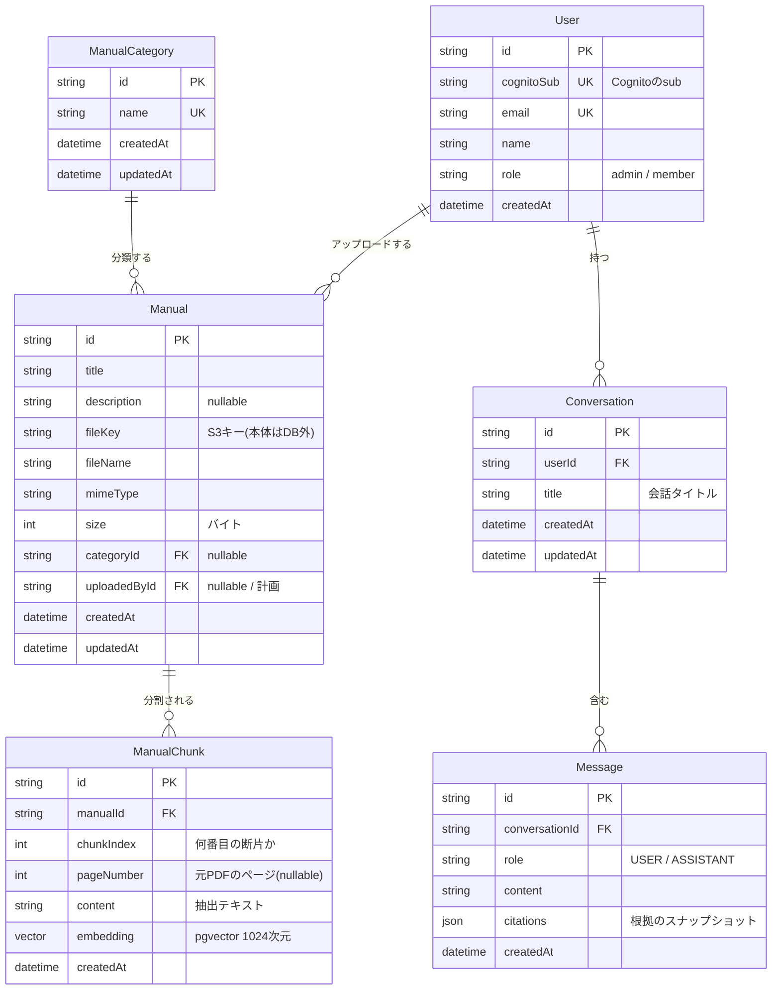

# ER図：社内マニュアル検索システム

現在のスキーマ（実装済み）と、今後追加予定のエンティティを含めた全体のデータモデル。

- ✅ 実装済み: `ManualCategory`, `Manual`, `ManualChunk`, `Conversation`, `Message`, `User`
- 🔄 設計変更: `Citation`テーブルは作らず、`Message.citations`（Json列）に回答時点のスナップショットとして保存する方式に変更（下記「設計上のポイント」参照）

## ER図（Mermaid）

```mermaid
erDiagram
    ManualCategory ||--o{ Manual : "分類する"
    Manual ||--o{ ManualChunk : "分割される"
    User ||--o{ Manual : "アップロードする"
    User ||--o{ Conversation : "持つ"
    Conversation ||--o{ Message : "含む"

    ManualCategory {
        string id PK
        string name UK
        datetime createdAt
        datetime updatedAt
    }
    Manual {
        string id PK
        string title
        string description "nullable"
        string fileKey "S3キー(本体はDB外)"
        string fileName
        string mimeType
        int size "バイト"
        string categoryId FK "nullable"
        string uploadedById FK "nullable / 計画"
        datetime createdAt
        datetime updatedAt
    }
    ManualChunk {
        string id PK
        string manualId FK
        int chunkIndex "何番目の断片か"
        int pageNumber "元PDFのページ(nullable)"
        string content "抽出テキスト"
        vector embedding "pgvector 1024次元"
        datetime createdAt
    }
    User {
        string id PK
        string cognitoSub UK "Cognitoのsub"
        string email UK
        string name
        string role "admin / member"
        datetime createdAt
    }
    Conversation {
        string id PK
        string userId FK
        string title "会話タイトル"
        datetime createdAt
        datetime updatedAt
    }
    Message {
        string id PK
        string conversationId FK
        string role "USER / ASSISTANT"
        string content
        json citations "根拠のスナップショット"
        datetime createdAt
    }
```

## エンティティの説明

| エンティティ | 状態 | 役割 |
| --- | --- | --- |
| ManualCategory | ✅実装済み | マニュアルのカテゴリ（サイドバーの分類） |
| Manual | ✅実装済み | マニュアル1件。PDF本体はS3、ここにはメタ情報のみ |
| ManualChunk | ✅実装済み | マニュアルを検索しやすい断片に分割＋埋め込みベクトル。RAGの心臓部 |
| User | ✅実装済み | 利用者。Cognitoの`sub`と紐付け、初回アクセス時に自動登録(JIT)。roleは今後の権限制御用 |
| Conversation | ✅実装済み | 1つの会話スレッド（サイドバーの履歴1行）。userIdで所有者に紐付く |
| Message | ✅実装済み | 会話内の各発言（ユーザー質問 / AI回答）。`citations` Json列に根拠を内包 |
| Citation | 🔄設計変更 | 独立テーブルにせず `Message.citations`（Json）に統合 |

## 関係（リレーション）

- `ManualCategory 1 ── N Manual` … 1カテゴリに複数マニュアル
- `Manual 1 ── N ManualChunk` … 1マニュアルを複数の断片に分割（RAG用）
- `User 1 ── N Conversation 1 ── N Message` … ユーザーごとの会話履歴
- AI回答と根拠マニュアルの関係は、`Message.citations`（Json）に回答時点のスナップショットとして内包（中間テーブルは作らない）

## 設計上のポイント

- 引用（根拠マニュアル）は `Message.citations` の Json 列に「回答時点のスナップショット」として保存する。独立した `Citation` テーブル（FK参照）にしなかったのは、後でマニュアルが削除・更新されても会話履歴がそのまま読めるようにするため（履歴は当時の事実の記録）。
- 認証は Cognito だが、アプリ側にも `User` テーブルを持ち `cognitoSub` で紐付ける。初回アクセス時に自動登録（JITプロビジョニング）され、`Conversation.userId` で会話の所有者を分離する。
- `embedding`(vector) は pgvector 型。Prismaが直接サポートしないため `Unsupported("vector(1024)")` で宣言し、読み書きは Python 側の生SQL（`<=>` コサイン距離演算子）で行う。
- チャンクは 800字 / 重複200字 で分割。マニュアル削除時は `onDelete: Cascade` でチャンクも自動削除される。
